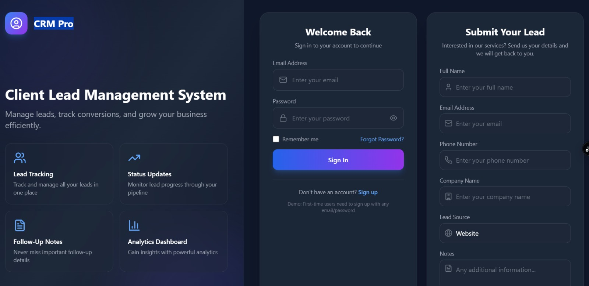
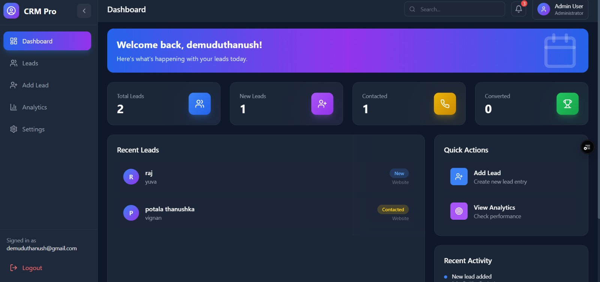
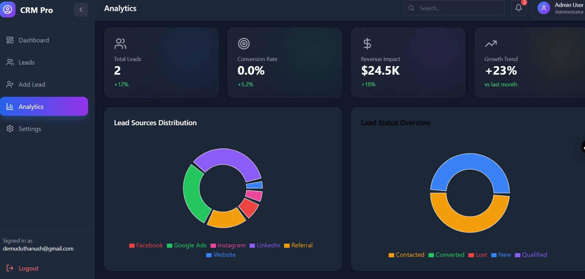

# FUTURE FS — Lead Management CRM

A modern, full-stack **Lead Management CRM** built with React, TypeScript, Supabase, and Tailwind CSS. Manage your sales pipeline, track leads from multiple sources, and gain insights through analytics — all in a sleek, animated dashboard.

🔗 **Live Demo:** https://thanushka.vercel.app

---

## Screenshots

### Login Page & Public Lead Capture


### Dashboard


### Analytics


---

## Features

- **Authentication** — Secure sign-up and sign-in via Supabase Auth (email + password)
- **Public Lead Capture Form** — Visitors can submit leads directly from the login page without an account
- **Dashboard** — At-a-glance stats: total leads, new, contacted, and converted counts
- **Lead Management** — Full CRUD (create, edit, delete) with search, status filtering, and source filtering
- **Analytics** — Charts for monthly leads vs conversions, lead source breakdown, and conversion rate trends
- **Settings** — User profile and preferences management
- **Protected Routes** — All dashboard pages require authentication; unauthenticated users are redirected to `/login`
- **Animated UI** — Smooth page and component transitions powered by Framer Motion

---

## Tech Stack

| Layer | Technology |
|---|---|
| Frontend | React 18, TypeScript, Vite |
| Styling | Tailwind CSS |
| Routing | React Router DOM v7 |
| Backend / DB | Supabase (PostgreSQL + Auth) |
| Charts | Recharts |
| Icons | Lucide React, React Icons |
| Animations | Framer Motion |
| Deployment | Vercel |

---

## Project Structure

```
src/
├── components/
│   ├── LeadForm.tsx          # Reusable form for adding/editing leads
│   ├── LeadTable.tsx         # Table with search, filter, edit, delete
│   ├── Navbar.tsx            # Top navigation bar
│   ├── Sidebar.tsx           # Side navigation menu
│   └── StatsCard.tsx         # Animated stats counter card
├── contexts/
│   └── AuthContext.tsx       # Global auth state (signIn, signUp, signOut)
├── data/
│   └── sampleData.ts         # Lead/data types and chart seed data
├── hooks/
│   └── useAnimatedCounter.ts # Hook for number animation on stats
├── layouts/
│   └── DashboardLayout.tsx   # Shared layout wrapper for all dashboard pages
├── pages/
│   ├── LoginPage.tsx         # Login/Sign-up + public lead capture form
│   ├── DashboardPage.tsx     # Overview with stats and quick actions
│   ├── LeadsManagementPage.tsx # Full leads list with filters
│   ├── AddLeadPage.tsx       # Add new lead form
│   ├── AnalyticsPage.tsx     # Charts and performance metrics
│   └── SettingsPage.tsx      # User settings
├── routes/
│   └── ProtectedRoute.tsx    # Auth guard for dashboard routes
└── utils/
    └── supabase.ts           # Supabase client initialization

supabase/
└── migrations/
    ├── 20260609163544_create_leads_table.sql       # Leads table + RLS policies
    └── 20260610064405_allow_anon_lead_submissions.sql  # Anon insert policy
```

---

## Lead Data Model

| Field | Type | Description |
|---|---|---|
| `id` | UUID | Auto-generated primary key |
| `full_name` | TEXT | Lead's full name (required) |
| `email` | TEXT | Lead's email address (required) |
| `phone` | TEXT | Phone number |
| `company_name` | TEXT | Company or organisation |
| `lead_source` | TEXT | Website, Facebook, Instagram, Google Ads, Referral, LinkedIn |
| `status` | TEXT | New, Contacted, Qualified, Converted, Lost |
| `notes` | TEXT | Free-text follow-up notes |
| `user_id` | UUID | FK to `auth.users` — row-level ownership |
| `created_at` | TIMESTAMPTZ | Auto-set on insert |
| `updated_at` | TIMESTAMPTZ | Auto-updated |

Row Level Security (RLS) ensures each authenticated user can only read, update, and delete their own leads.

---

## Getting Started

### Prerequisites

- Node.js 18+
- A [Supabase](https://supabase.com) project

### 1. Clone the repository

```bash
git clone https://github.com/your-username/FUTURE_FS_02.git
cd FUTURE_FS_02
```

### 2. Install dependencies

```bash
npm install
```

### 3. Configure environment variables

Create a `.env` file in the project root:

```env
VITE_SUPABASE_URL=https://your-project-id.supabase.co
VITE_SUPABASE_ANON_KEY=your-anon-key-here
```

You can find these values in your Supabase project under **Settings → API**.

### 4. Apply database migrations

In the Supabase dashboard, open the **SQL Editor** and run the two migration files in order:

1. `supabase/migrations/20260609163544_create_leads_table.sql`
2. `supabase/migrations/20260610064405_allow_anon_lead_submissions.sql`

Or use the Supabase CLI:

```bash
supabase db push
```

### 5. Start the development server

```bash
npm run dev
```

The app will be available at `http://localhost:5173`.

---

## Available Scripts

| Command | Description |
|---|---|
| `npm run dev` | Start the local development server |
| `npm run build` | Build for production |
| `npm run preview` | Preview the production build locally |
| `npm run lint` | Run ESLint |
| `npm run typecheck` | Run TypeScript type checking |

---

## Deploying to Vercel

1. Push your repository to GitHub.
2. Import the project in [Vercel](https://vercel.com).
3. Add your environment variables (`VITE_SUPABASE_URL` and `VITE_SUPABASE_ANON_KEY`) in **Project Settings → Environment Variables**.
4. Deploy. Vercel auto-detects Vite and sets the build command to `npm run build` with output directory `dist`.

---

## Environment Variables

| Variable | Description |
|---|---|
| `VITE_SUPABASE_URL` | Your Supabase project URL |
| `VITE_SUPABASE_ANON_KEY` | Your Supabase project anonymous/public key |

> ⚠️ Never commit your `.env` file. It is already listed in `.gitignore`.

---

## License

This project is private. All rights reserved.
